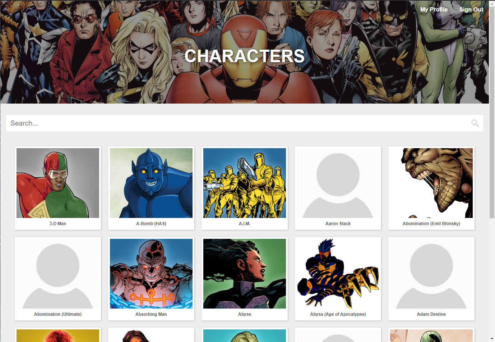
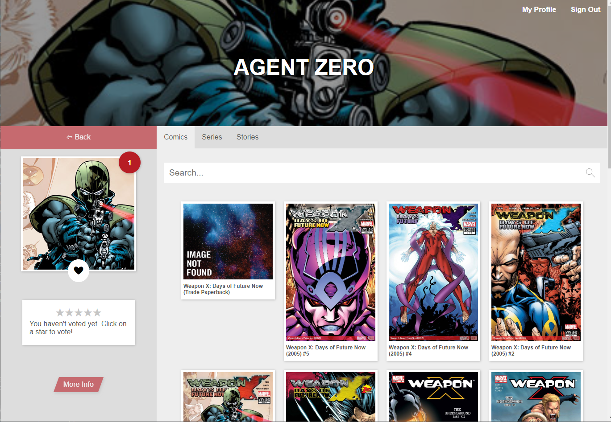
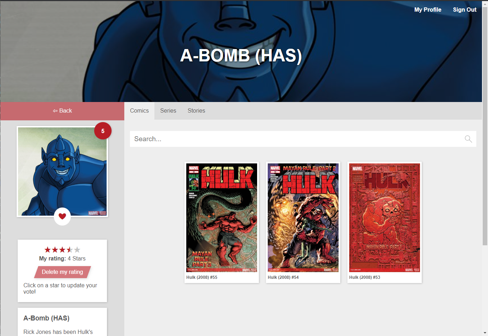

# MarvelApp

This is an educational Angular SPA consuming 2 RESTful APIs: The official Marvel API and a custom made API (Laravel).

This project was originally generated with [Angular CLI](https://github.com/angular/angular-cli) version 8.3.9 and has been updated / upgraded to Angular version 10 including all dependencies (e.g. NgRx).

This Angular App was created during my internship at [Liip](https://www.liip.ch)

---
# Screenshots

*The home screen*

---


*Character detail page while logged in, no ratings and not favorized.*

---


*Character detail page, with ratings and favorized.*

---
# How to run the app

## Marvel API
First of all you'll need your own API credentials from the official Marvel API (https://developer.marvel.com). Add those credentials to the `environment.ts` file (src/environments/environment.ts) or...

...you do the same as i did and add the API credentials to `environment.prod.ts`. I did this out of convenience, this is by no means good practice!


```typescript
export const environment = {
  production: true,

  marvelApiUrl: 'http://gateway.marvel.com/v1/public',

  // Credentials for the Marvel API
  apiPublicKey: 'MyPublicKey',
  apiPrivateKey: 'MyPrivateKey',
  timeStamp: 'MyTimestamp',

  // md5(Timestamp + Private Key + Public Key)
  // md5(MyTimestampMyPrivateKeyMyPublicKey)
  hash: 'MyGeneratedHash',

  apiInitialOffset: 0,
  apiResultLimit: 20,
  apiTypeaheadResultLimit: 5,

  // Backend (Laravel)
  backEndApiUrl: 'http://localhost:8080/api/v1',
  authClientId: 123,
  authClientSecret: 'someSecretStringFromTheLaravelAuthApi'
};
```

`timeStamp` is just any random string (refer to the documentation) and the hash is generated via MD5 algorithm.

## Install dependencies (npm)
`npm install`

## Run the App via runtime (aka Angular CLI)
Once you got everything set up, just run `ng serve` or `ng serve --prod` if you added the credentials to `environment.prod.ts`.

## Run the App via Docker
Alternatively you can run the app via Docker. You need to build the image first, run (in the project / repository root folder) `docker-compose build`. Then run `docker-compose up`.
Mind you, this way changes in the source WON'T rebuild on its own!

Why docker-compose for a single image / container? Out of convenience...

## Backend (Optional)
For further features, like a (character) visitor counter, a option to "like" / "favorize" characters, a 5-star rating system, a user profile and so on, a backend was added (REST). Currently the following backend options are available or work in progress:

- **Laravel** (+ MySQL) in this [repository](https://github.com/DatSwissGuy/marvel-app-backend).
- **.NET core** (+ Any Database), currently work in progress, really hard to get into, this will certainly take a while.

# Additional information

## TODO's
These items are in no particular order or priority.

- Finish this readme 😅
- Clean up code e.g. get rid of some anti-patterns (E.g. current route via NgRx)
- ~~Add inital docker support to run the app~~
- Add a check if the backend is available, and if not, don't show the login header
- Add AuthGuard for the user profile page
- ~~Add initial server side rendering and also "dockerize" it~~
- Add a multi stage docker setup: 1. build the application, 2. serve / run the app
- Add a "full-stack" repository so the app including backend can be run with a single `docker-compose up` command.


## WIP's
- SSR still not working the way i'd like
- Better docker setups

## DONT'S
Don't use this app for production! It's for educational purposes only! 

One of the many reasons is the missing copyright annotations (which Marvel demands if you publish something which makes use of their API) and besides that, the access token from the backend is saved in local storage, which is a really bad practice!
Also: anti-patterns ☹️
